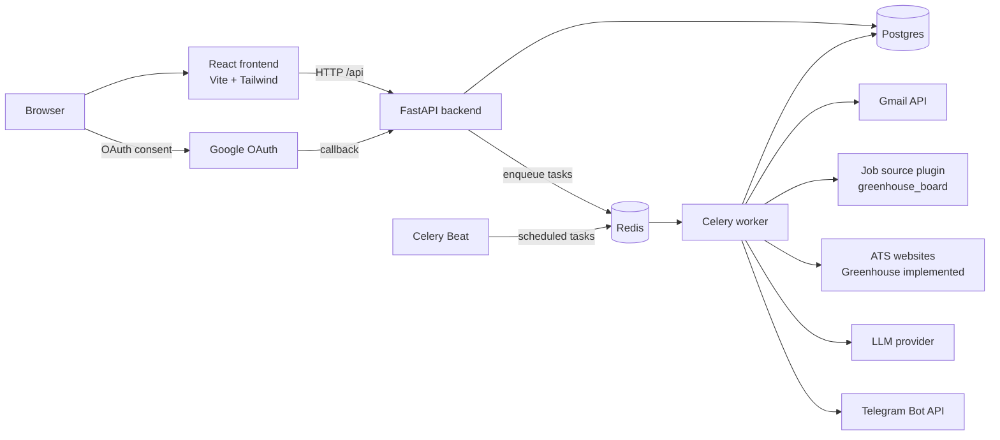
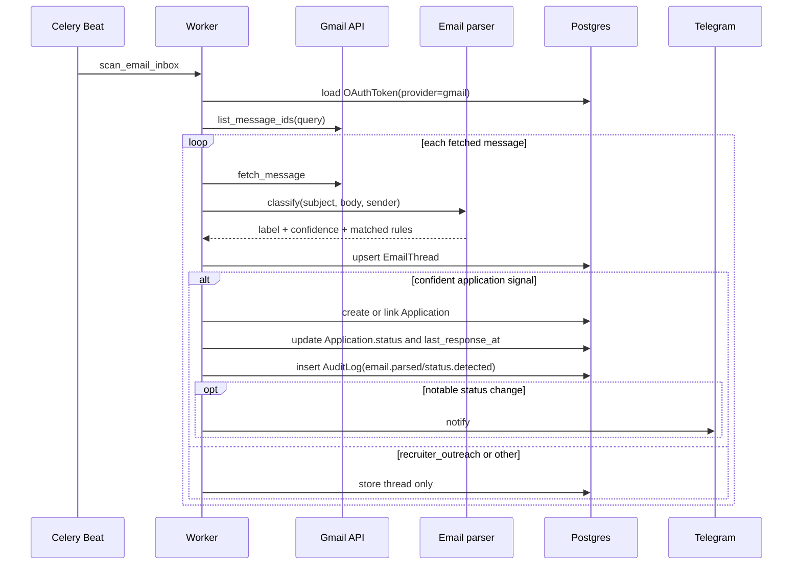
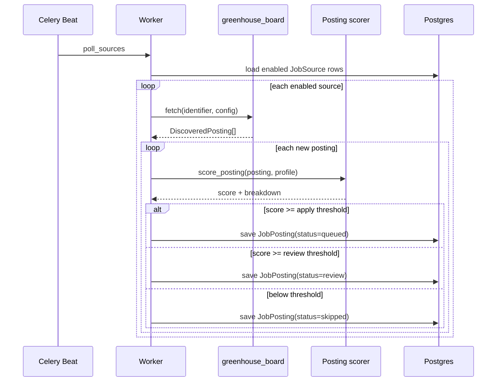
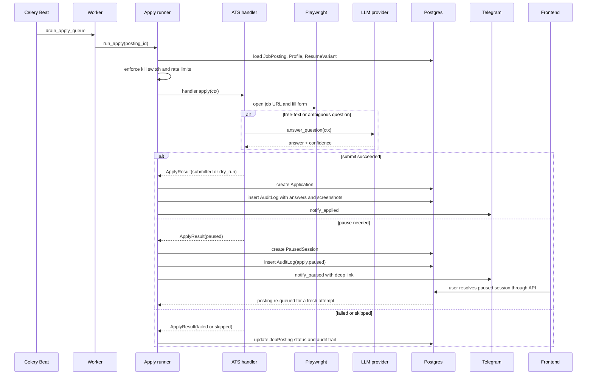
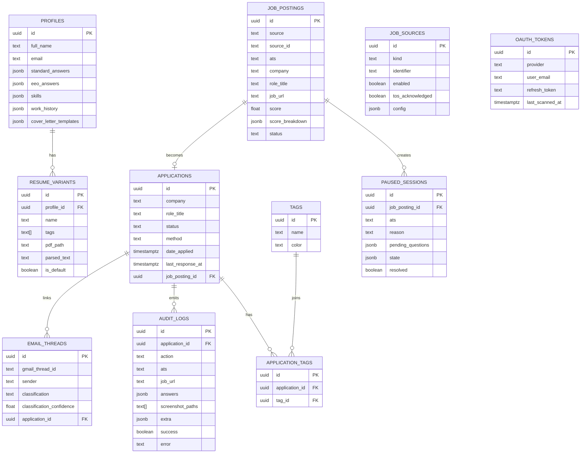

# Architecture

Job Tracker is a single-user, local-first system with a clear split between the
interactive dashboard and the background automation pipeline.

The current implementation is strongest in four areas:

- manual application tracking
- Gmail read-only inbox scanning
- Greenhouse job discovery
- Greenhouse auto-apply with human-in-the-loop pauses

Everything else in this document is described from the code that exists today,
not from the longer-term product roadmap.

## System context



## Runtime topology

| Runtime unit | Source | Responsibility |
| --- | --- | --- |
| `frontend` | `frontend/` | Dashboard UI and workflow pages |
| `backend` | `backend/app/main.py` | REST API, OAuth endpoints, CRUD, analytics |
| `postgres` | Compose / K8s | Durable relational store |
| `redis` | Compose / K8s | Celery broker and result backend |
| `worker` | `backend/app/workers/tasks.py` | Email scan, source polling, apply runs, stale sweep |
| `beat` | `backend/app/workers/celery_app.py` | Periodic task scheduler |
| `storage` volume | `/app/storage` | Resume PDFs and Playwright screenshots |

## Current implementation status

| Area | Status | Notes |
| --- | --- | --- |
| Manual tracking | Implemented | CRUD, tags, notes, detail page, audit log, analytics |
| Master profile and resume variants | Implemented | PDF upload, parsed text, default resume selection |
| Gmail OAuth and email scan | Implemented | Read-only Gmail integration with status classification |
| Job source polling | Partially implemented | `greenhouse_board` plugin is live; other kinds are UI scaffolding only |
| ATS auto-apply | Partially implemented | `greenhouse` handler is live; Lever, Workday, Ashby, iCIMS, LinkedIn, and Indeed are stub handlers |
| Paused-session review | Implemented | Captures questions and screenshot path, then re-queues after user input |
| Notifications | Implemented | Telegram notifications for paused/apply/kill switch |
| Multi-user hosting | Not implemented | Current design assumes one user and one profile |

## Directory map

```text
backend/app/api/           FastAPI routers and response schemas
backend/app/models/        SQLAlchemy models
backend/app/services/email Gmail OAuth, fetch, parsing, thread linking
backend/app/services/sources/ Job source plugin registry and fetchers
backend/app/services/ats/  ATS handler registry and Playwright automation
backend/app/services/automation/runner.py
                           Core apply orchestration and audit logging
backend/app/workers/       Celery app and scheduled/background tasks
frontend/src/pages/        Dashboard, postings, paused queue, analytics, profile, settings
docs/                      Architecture and operator notes
```

## Frontend surface

The SPA is intentionally thin. It talks directly to the REST API and does not
carry business logic beyond form state and small UI conveniences.

| Route | Purpose |
| --- | --- |
| `/` | Pipeline dashboard and search/filtering |
| `/applications/:id` | Application detail, linked emails, audit log |
| `/postings` | Discovered posting review and approval queue |
| `/paused` | Paused automation queue |
| `/paused/:id` | Human resolution of blocked questions |
| `/analytics` | Summary metrics and weekly activity |
| `/profile` | Master profile and resume uploads |
| `/settings` | Gmail connection, source management, kill switch |

## API surface

The backend is organized around five router groups.

| Router | Prefix | Responsibility |
| --- | --- | --- |
| `applications` | `/api/applications` | CRUD, audit lookup, linked email lookup |
| `profile` | `/api/profile` | Master profile and resume variant uploads |
| `auth` | `/api/auth` | Gmail OAuth start/callback/status/disconnect |
| `automation` | `/api/automation` | Kill switch, source management, postings, paused sessions, manual task triggers |
| `analytics` | `/api/analytics` | Aggregate job-search metrics |

## Worker schedule

`Celery Beat` drives four recurring tasks:

| Task | Schedule | Purpose |
| --- | --- | --- |
| `scan_email_inbox` | every 15 minutes | Pull Gmail messages and update applications |
| `poll_sources` | hourly | Fetch new postings and score them |
| `drain_apply_queue` | every 3 minutes | Fan out queued postings into apply tasks |
| `sweep_stale_applications` | daily at 09:00 UTC | Mark older unanswered applications as `ghosted` |

## Core data flows

### Gmail scan and status detection



### Source polling and scoring



### Apply runner and human-in-the-loop pauses



## Database model

The data model is intentionally compact. Most complex form state is stored in
JSONB columns so the product can iterate quickly without constant migrations.



## Extension points

Two registries make the system extensible without changing the core worker
logic.

### Source plugins

Source plugins normalize external job feeds into a shared `DiscoveredPosting`
shape.

```python
from app.services.sources.base import DiscoveredPosting, JobSourcePlugin
from app.services.sources.registry import register_source

@register_source("my_source")
class MySource(JobSourcePlugin):
    def fetch(self, identifier: str, config: dict) -> list[DiscoveredPosting]:
        ...
```

Today, only `greenhouse_board` is imported and active.

### ATS handlers

ATS handlers own the Playwright logic for one application system.

```python
from app.services.ats.base import ATSHandler, ApplyContext, ApplyResult
from app.services.ats.registry import register

@register("myats")
class MyATSHandler(ATSHandler):
    domain_patterns = ["jobs.example.com"]

    async def apply(self, ctx: ApplyContext) -> ApplyResult:
        ...
```

The runner looks up handlers by `JobPosting.ats`, so the orchestration layer
does not need to know anything about platform-specific selectors.

## Operational notes and limitations

- The product assumes one user and one active profile.
- Gmail OAuth state is cached in memory inside the API process. That is fine for
  the current single-user MVP but not for multi-instance deployment.
- The kill switch endpoint mutates in-memory settings only. Persisting it would
  require a shared store such as Redis or a database-backed flag.
- Paused runs currently restart from the job posting URL after the user answers
  questions. They do not restore mid-form browser state yet.
- Non-Greenhouse ATS handlers currently return `skipped`, so they should be
  treated as placeholders rather than active automation targets.
